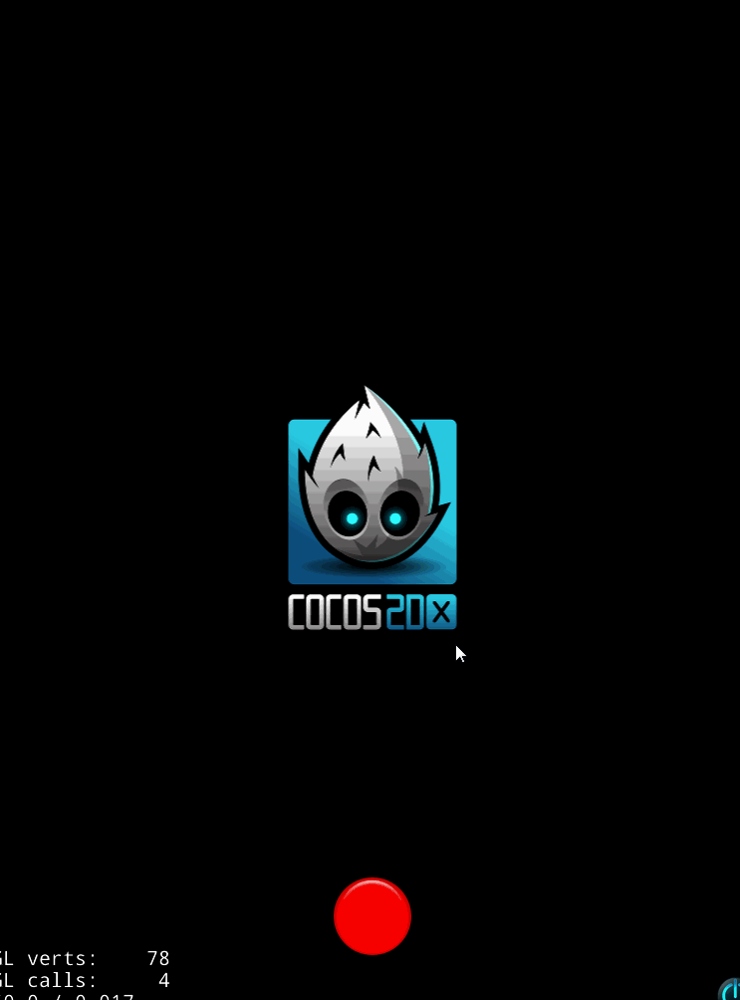
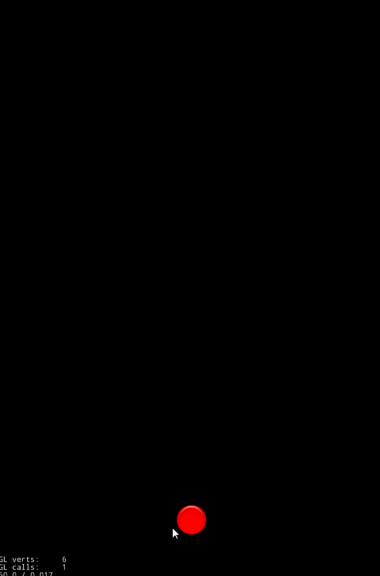

# cocos2d-x shooting game tutorial



- [cocos2d-x shooting game tutorial](#cocos2d-x-shooting-game-tutorial)
  - [全体像の把握 (イメージ)](#%E5%85%A8%E4%BD%93%E5%83%8F%E3%81%AE%E6%8A%8A%E6%8F%A1-%E3%82%A4%E3%83%A1%E3%83%BC%E3%82%B8)
  - [CREATE_FUNCでcocos-2dx流のメモリ管理(自動開放)](#createfunc%E3%81%A7cocos-2dx%E6%B5%81%E3%81%AE%E3%83%A1%E3%83%A2%E3%83%AA%E7%AE%A1%E7%90%86%E8%87%AA%E5%8B%95%E9%96%8B%E6%94%BE)
  - [画面サイズ変更](#%E7%94%BB%E9%9D%A2%E3%82%B5%E3%82%A4%E3%82%BA%E5%A4%89%E6%9B%B4)
  - [TitleScene](#titlescene)
    - [1 TitleScene作成](#1-titlescene%E4%BD%9C%E6%88%90)
    - [2 更新処理(update)を呼ぶ](#2-%E6%9B%B4%E6%96%B0%E5%87%A6%E7%90%86update%E3%82%92%E5%91%BC%E3%81%B6)
    - [3 汎用的な処理はutilクラスでも作っておく](#3-%E6%B1%8E%E7%94%A8%E7%9A%84%E3%81%AA%E5%87%A6%E7%90%86%E3%81%AFutil%E3%82%AF%E3%83%A9%E3%82%B9%E3%81%A7%E3%82%82%E4%BD%9C%E3%81%A3%E3%81%A6%E3%81%8A%E3%81%8F)
    - [4 ボタン追加 & シーン切り替え](#4-%E3%83%9C%E3%82%BF%E3%83%B3%E8%BF%BD%E5%8A%A0-%E3%82%B7%E3%83%BC%E3%83%B3%E5%88%87%E3%82%8A%E6%9B%BF%E3%81%88)
  - [GameScene](#gamescene)
    - [5 シーン切り替えの遷移終了からupdateを行いたい](#5-%E3%82%B7%E3%83%BC%E3%83%B3%E5%88%87%E3%82%8A%E6%9B%BF%E3%81%88%E3%81%AE%E9%81%B7%E7%A7%BB%E7%B5%82%E4%BA%86%E3%81%8B%E3%82%89update%E3%82%92%E8%A1%8C%E3%81%84%E3%81%9F%E3%81%84)
    - [6 画面全体のタッチイベント](#6-%E7%94%BB%E9%9D%A2%E5%85%A8%E4%BD%93%E3%81%AE%E3%82%BF%E3%83%83%E3%83%81%E3%82%A4%E3%83%99%E3%83%B3%E3%83%88)
    - [7 プレイヤー作成 && タッチで移動](#7-%E3%83%97%E3%83%AC%E3%82%A4%E3%83%A4%E3%83%BC%E4%BD%9C%E6%88%90-%E3%82%BF%E3%83%83%E3%83%81%E3%81%A7%E7%A7%BB%E5%8B%95)
    - [8 弾を生成する](#8-%E5%BC%BE%E3%82%92%E7%94%9F%E6%88%90%E3%81%99%E3%82%8B)
    - [9 弾を発射 → 移動 → 削除](#9-%E5%BC%BE%E3%82%92%E7%99%BA%E5%B0%84-%E2%86%92-%E7%A7%BB%E5%8B%95-%E2%86%92-%E5%89%8A%E9%99%A4)
    - [10 敵の作成](#10-%E6%95%B5%E3%81%AE%E4%BD%9C%E6%88%90)
    - [11 敵の生成 → 移動 → 削除](#11-%E6%95%B5%E3%81%AE%E7%94%9F%E6%88%90-%E2%86%92-%E7%A7%BB%E5%8B%95-%E2%86%92-%E5%89%8A%E9%99%A4)
    - [12 弾と敵のあたり判定](#12-%E5%BC%BE%E3%81%A8%E6%95%B5%E3%81%AE%E3%81%82%E3%81%9F%E3%82%8A%E5%88%A4%E5%AE%9A)
    - [13 残り時間とスコアの作成](#13-%E6%AE%8B%E3%82%8A%E6%99%82%E9%96%93%E3%81%A8%E3%82%B9%E3%82%B3%E3%82%A2%E3%81%AE%E4%BD%9C%E6%88%90)
  - [ScoreScene](#scorescene)
    - [14 スコアシーン作成 スコアの受け渡し タイトルに戻る](#14-%E3%82%B9%E3%82%B3%E3%82%A2%E3%82%B7%E3%83%BC%E3%83%B3%E4%BD%9C%E6%88%90-%E3%82%B9%E3%82%B3%E3%82%A2%E3%81%AE%E5%8F%97%E3%81%91%E6%B8%A1%E3%81%97-%E3%82%BF%E3%82%A4%E3%83%88%E3%83%AB%E3%81%AB%E6%88%BB%E3%82%8B)


久々にcocos2d-xを触った。

全体的に忘れていたので、シューティングゲームを作りがてらまとめを書いていく。

環境構築がかなり引っかかったがめんどくさいのでそこはふっ飛ばすジェットバス。

visual studioで動けばいい前提。

#include系ははしょります。


## 全体像の把握 (イメージ)

Directorがどこからでもアクセスできるので、シーン切り替えなどをこれで行える。
Sceneごとに必要なUIをaddChildする。layerはbackground、HUDなどの分割が
可能。Nodeを親として、子要素にUI, button, labelなど複数の要素のグループ化
が可能。その際、親(Node)の座標を動かすことで、addChildした子要素全体を動かすことが
できるので、個々を動かす必要がなく便利。

- Director
  - Scene1
    - Layer
      - Node
        - button
        - label
        - sprite
        - ...
  - Scene2
    - Layer
      - Node
        - button
        - label
        - sprite
        - ...
  - Scene3
    - button
    - label
    - ...

## CREATE_FUNCでcocos-2dx流のメモリ管理(自動開放)

[リファレンスカウンタ](http://rinov.jp/cocos-doujo-dx/3-1.html)

CREATE_FUNC、init。これをしておけば、メモリがcocos側で管理され、開放し忘れとかのわかりづらい
バグをどうにかできるだったかどうか...。

## 画面サイズ変更
初期画面がちっちゃすぎるので、適当にいじる。

`AppDelegate.cpp`
```cpp
static cocos2d::Size designResolutionSize = cocos2d::Size(640, 960);
```

## TitleScene


### 1 TitleScene作成

```cpp
class TitleScene : public cocos2d::Scene {
public:
  CREATE_FUNC(TitleScene);

private:
  virtual bool init();
  void update(float dt);
};
```

```cpp
bool TitleScene::init() {
  if (Scene::init) { return false; }

  return true;
}
```

### 2 更新処理(update)を呼ぶ

スケジュールを使ってupdate関数を呼ぶ。毎フレーム呼ばれ、updateの引数には、
時間が入ってる。

```cpp
bool TitleScene::init() {
  ...
  this->scheduleUpdate();

  return true;
}

void TitleScene::update(float dt) {
  CCLOG("UPDATE");
}
```

`AppDelegate.cpp`
```cpp
  auto scene = TitleScene::create();
```


### 3 汎用的な処理はutilクラスでも作っておく

これ作って置くことで、入力を短縮できる。
```cpp
class util {
public:
  static Vec2 mid() {
    auto size = Director::getInstance()->getVisibleSize();
    auto origin = Director::getInstnace()->getVisibleOrigin();

    return Vec2(size.width / 2 + origin.x, size.height / 2 + origin.y);
  }

  static Size size() {
    return Director::getInstance()->getVisibleSize();
  }
};
```

### 4 ボタン追加 & シーン切り替え

大体グーグルで検索すれば出てくるので、[http://falstar.hateblo.jp/entry/2016/07/18/161449](http://falstar.hateblo.jp/entry/2016/07/18/161449)を参考に。

- ボタンの画像を用意する。[http://sozai.akuseru-design.com/category/sozai/button/](http://sozai.akuseru-design.com/category/sozai/button/)
- ボタン作成
- ボタンタッチ後(TouchEventType::ENDED)にDirectorのreplaceSceneでシーン切り替え

```cpp
class TitleScene : public cocos2d::Scene {
...
private:
  cocos2d::ui::Button* createButton(const std::string& normal, const std::string& select = "", const std::string& disable = "");
}
```

```cpp
bool TitleScene::init() {
  ...
  createButton("btn_01.png");

  ...
}

cocos2d::ui::Button* TitleScene::createButton(const std::string& normal, const std::string& select, const std::string& disable) {
  auto button = ui::Button::create();
  button->setTouchEnabled(true);
  button->loadTextures(normal, select, disable);
  button->setPosition(Vec2(util::mid().x, 100));

  button->addTouchEventListener([this](Ref* sender, ui::Widget::TouchEventType type) {
    if (type == ui::Widget::TouchEventType::ENDED) {
      CCLOG("TOUCH end");

      // シーン切り替え
      Director::getInstance()->replaceScene(TransitionSlideInR::create(0.5f, GameScene::createScene()));
    }
  });

  addChild(button);

  return button;
}
```

## GameScene

### 5 シーン切り替えの遷移終了からupdateを行いたい

replaceSceenなどで遷移したときに、initにschduleUpdateを書いてしまうと、遷移中に
updateが動き出してしまいます。なので遷移処理が終了したタイミングよばれる関数が用意
されていますので、それを使いましょう。

[http://d.hatena.ne.jp/nkawamura/20150516/1431736186](http://d.hatena.ne.jp/nkawamura/20150516/1431736186)

```cpp
class GameScene: public cocos2d::Scene {
pubilc:
  CREATE_FUNC(GameScene);

private:
  virtual bool init();
  virtual void update(float dt);
  virtual void onEnterTransitionDidFinish();
};
```

```cpp
void GameScene::onEnterTransitionDidFinish() {
  this->scheduleUpdate();
}
```


### 6 画面全体のタッチイベント

シーンをタッチイベントの対象としてリスナーにぶっこむ

[https://www.bbsmax.com/A/E35pLXOy5v/](https://www.bbsmax.com/A/E35pLXOy5v/)

```cpp
class GameScene: public cocos2d::Scene {
pubilc:
  CREATE_FUNC(GameScene);

private:
  virtual bool init();
  ...

  // 画面タッチイベント
  virtual bool onTouchBegan(cocos2d::Touch* touch, cocos2d::Event* event);
  virtual void onTouchMoved(cocos2d::Touch* touch, cocos2d::Event* event);
  virtual void onTouchEnded(cocos2d::Touch* touch, cocos2d::Event* event);
};
```

```cpp
bool GameScene::init() {
  if (!Scene::init()) { return false; }

  auto listener = EventListenerTouchOneByOne::create();
  listener->onTouchBegan = CC_CALLBACK_2(GameScene::onTouchBegan, this);
  listener->onTouchMoved = CC_CALLBACK_2(GameScene::onTouchMoved, this);
  listener->onTouchEnded = CC_CALLBACK_2(GameScene::onTouchEnded, this);
  _eventDispatcher->addEventListenerWithSceneGraphPriority(listener, this);
}

bool GameScene::onTouchBegan(Touch* touch, Event* event) {
  CCLOG("touch began");
  return true;
}
void GameScene::onTouchMoved(Touch* touch, Event* event) {
  CCLOG("touch moved");
}
void GameScene::onTouchEnded(Touch* touch, Event* event) {
  CCLOG("touch ended");
}
```

### 7 プレイヤー作成 && タッチで移動

前回のタッチ位置と今回のタッチ位置を比較し、その差分分、
プレイヤーを移動させることで、どこをタッチしてスライドしても
同様の量をプレイヤーが動いてくれるようになります。

ボタン画像以外用意してないので、三角形をプレイヤーとして、作成していきます。
上記でのタッチイベントを利用し、タッチしている状態で動かした場合に、動いた分を
プレイヤーも動くようにします。

[http://befool.co.jp/blog/chainzhang/cocos2dx-drawnode/](http://befool.co.jp/blog/chainzhang/cocos2dx-drawnode/)を
参考に三角形を作成。使いまわせるようutilクラスに追加。

```cpp
class util {
  ...

  static DrawNode* triangle(const Vec2& position, const Size& size, const Color4F& color) {
    auto node = DrawNode::create();
    node->drawTriangle(Vec2::ZERO, Vec2(size.width / 2, size.height), Vec2(size.width, 0), color);
    node->setPosition(position);
    return node;
  }
};
```

```cpp
class GameScene : public cocos2d::Scene {
  ...

private:
  cocos2d::Vec2 touch_position_;
  cocos2d::DrawNode* player_;
  ...
};
```

```cpp
bool GameScene::init() {
  ...
  player_ = util::create::triangle(Vec2(util::mid().x, 120), Size(50, 50), Color4F::BLUE);
  addChild(player_);
}

bool GameScene::onTouchBegan(Touch* touch, Event* event) { 
  touch_position_ = touch->getLocation();
}
void GameScene::onTouchMoved(Touch* touch, Event* event) { 
  auto diff_position = touch->getLoction() - touch_position_;
  touch_position_ = touch->getLocation();
  player_->setPosition(player_->getPoisition() + diffPosition);
}
void GameScene::onTouchEnded(Touch* touch, Event* event) {

}
```

### 8 弾を生成する

弾は円で描画する。[http://befool.co.jp/blog/chainzhang/cocos2dx-drawnode/](http://befool.co.jp/blog/chainzhang/cocos2dx-drawnode/)を参考に円を作成。
そして弾は連射するので、弾を管理するBulletManagerクラスを作成する。

```cpp
class util {
  ...
  static DrawNode* circle(const Vec2& position, float radius, const Color4F& color) {
    auto node = DrawNode::create();
    node->drawDot(Vec2::ZERO, radius, color);
    node->setPosition(position);
    return node;
  }
};
```

```cpp
class BulletManager : public cocos2d::Node {
public:
  CREATE_FUNC(BulletManager);

private:
  std::vector<cocos2d::DrawNode*> bullets_;

public:
  virtual bool init();
  void update();
};
```

```cpp
bool BulletManager::init() {
  if (!Node::init()) { return false; }

  // とりあえず100個
  bullets_.resize(100);
  for (size_t i = 0; i < bullets_.size(); ++i) {
    auto bullet = util::circle(util::mid(), 15.0f, Color4F::WHITE);
    bullet->setVisible(false);

    bullets_[i] = bullet;
    addChild(bullets_[i]);
  }

  return true;
}
```


### 9 弾を発射 → 移動 → 削除

- プレイヤーが画面をタッチしている間は弾を打ち続ける
- 生成された弾はupdateで毎フレーム移動。
- 画面外に出た場合、弾を削除する

押しっぱなしの判定のために、`is_touch_display_`変数を作成。

押しっぱなしだと毎フレーム弾が発射され、弾が繋がって見えるので、
間隔を空けて発射させます。

今回は`isVisible()`を使って、表示 = 弾は生成されている、
非表示 = 弾は生成されていないというふうにする。

後々にあたり判定なども行うので、`contentSize`も設定しておく。

```cpp
class BulletManager : public cocos2d::Node {
  ...
private:
  const float INTERVAL = 0.1f;
  const float SPEED = 30.0f;

  // INTERVAL中は発射無効
  bool can_shot_ = ture;

public:
  void update();
  void shot(const cocos2d::Vec2& position);
};
```

```cpp
void BulletManager::update() {
  for (size_t i = 0; i < bullets_.size(); ++i) {
    auto bullet = bullets_[i];
    // 生成されていない弾は処理しない
    if (!bullet->isVisible()) { continue; }

    auto pos = bullet->getPosition();
    // 画面外なら削除
    if (pos.y >= util::size().height) {
      bullet->setVisible(false);
    } else {
      pos.y += BulleManager::SPEED;
    }

    bullet->setPosition(pos);
  }
}

void BulletManager::shot(const Vec2& position) {
  if (!can_shot_) { return; }

  for (size_t i = 0; i < bullets_.size(); ++i) {
    auto bullet = bullets_[i];

    // 生成されていない弾から発射する
    if (bullet->isVisible()) { continue; }

    can_shot_ = false;
    bullet->setVisible(true);
    bullet->setPosition(position);

    auto action1 = DelayTime::create(BulletManager::INTERVAL);
    auto action2 = CallFunc::create([this]() {
      can_shot_ = true;
    });
    auto seq = Sequence::create(action1, action2, NULL);
    this->runAction(seq);

    return;
  }
}
```

```cpp
class GameScene : public cocos2d::Scene {
private:
  ...
  BulletManager* bullet_manager_;
  bool is_touch_display_;

private:
  ...
  void shot();
};
```

```cpp
bool GameScene::init() {
  ...
  plyer_->setContentSize(Size(50, 50));
  ...

  bullet_manager_ = BulletManager::create();
  addChild(bullet_manager_);

  is_touch_display_ = false;

  return true;
}

void GameScene::update(float dt) {
  if (is_touch_display_) {
    shot();
  }

  bullet_manager_->update();
}

void GameScene::shot() {
  // 弾をプレイヤーの中央上に配置する
  auto pos = Vec2(player_->getPosition().x + player_->getContentSize().width / 2, player_->getPosition().y + player_->getContentSize().height);
  bullet_manager_->shot(pos);
}

bool GameScene::onTouchBegan(Touch* touch, Event* event) {
  ...
  is_touch_display_ = true;
  return true;
}
void GameScene::onTouchMoved(Touch* touch, Event* event) {
  ...
}
void GameScene::onTouchEnded(Touch* touch, Event* event) {
  ...
  is_touch_display_ = false;
}
```

<br>
<br>
<br>

ここまでの完成度




### 10 敵の作成

- 敵クラス作成
- 敵は逆三角形で描画
- 敵クラスでは描画物(draw_node_)を動かすのではなく、Enemy(Node)自身を動かす。
- 敵の種類も作りたいがめんどうなんで、今回１種類のみ
- 敵も複数体出現するので、敵マネージャークラスの作成


```cpp
class util {
  ...
  static DrawNode* reverseTriangle(const Vec2& position, const Size& size, const Color4F& color) {
    auto node = DrawNode::create();
    node->drawTriangle(Vec2(0, size.height), Vec2(size.width / 2, 0), Vec2(size.width, size.height), color);
    node->setPosition(position);

    return node;
  }
};
```

```cpp
class Enemy : public cocos2d::Node {
public:
  CREATE_FUNC(Enemy);

public:
  enum Type {
    Straight, // 直線移動タイプ
  };

private:
  Type type_;
  cocos2d::DrawNode* draw_node_;


public:
  virtual bool init();
};
```

```cpp
bool Enemy::init() {
  if (!Node::init()) { return false; }

  draw_node_ = util::reverseTriangle(Vec2::ZERO, Size(80, 80), Color4F::ORANGE);
  addChild(draw_node_);
  setContentSize(Size(80, 80));
  type_ = Type::Straight;

  return true;
}
```

```cpp
class EnemyManager : public cocos2d::Node {
public:
  CREATE_FUNC(EnemyManager);

private:
  std::vector<Enemy*> enemys_;

public:
  virtual bool init();
};
```

```cpp
bool EnemyManager::init() {
  if (!Node::init()) { return false; }

  enemys_.resize(50);
  for (size_t i = 0; i < enemys_.size(); ++i) {
    auto enemy = Enemy::create();
    enemy->setVisible(false);
    enemys_[i] = enemy;
    addChild(enemy);
  }

  return true;
}
```

### 11 敵の生成 → 移動 → 削除

- 敵も弾と同様にisVisibleで表示 = 生存、非表示 = 死亡。
- 数秒毎に自動生成する処理をEnemyManagerで行う。

```cpp
class Enemy {
...
public:
  void enable(const cocos2d::Vec2& position);
  void disable();
  void update();
  void straight();
};
```

```cpp
void Enemy::enable(const Vec2& position) {
  setVisible(true);
  setPosition(position);
}

void Enemy::disable() {
  setVisible(false);
  setPosition(Vec2::ZERO);
}

void Enemy::update() {
  // 死亡しているなら、処理しない
  if (!this->isVisible()) { return; }

  // 敵タイプによって動作変更を想定
  switch(type_) {
    case Type::Straight: straight(); break;
  }
}

// 下へ進む
void Enemy::straight() {
  auto pos = getPosition();
  pos.x -= 0;
  pos.y -= 10;
  setPosition(pos);
}
```

```cpp
class EnemyManager : public cocos2d::Node {
...
public:
  void update();
  void enable(const cocos2d::Vec2& position);
};
```

```cpp
bool EnemyManager::init() {
  ...

  auto action1 = DelayTime::create(1.0f);
  auto action2 = CallFunc::create([this]() {
    // x軸は真ん中から-200 <= x <= 200の範囲でランダム生成
    // y軸は一番上から
    auto rand = RandomHelper::random_int(-200, 200);
    enable(Vec2(util::mid().x + rand, util::size().height));
    CCLOG("Spawing Enemy");
  });
  auto seq = Sequence::create(action1, action2, NULL);
  auto re = RepeatForever::create(seq);
  this->runAction(re);

  return true;
}

void EnemyManager::update() {
  for (size_t i = 0; i < enemys_.size(); ++i) {
    auto enemy = enemys_[i];
    enemy->update();

    auto pos = enemy->getPosition();
    if (pos.y < 0) {
      enemy->disable();
    }
  }
}

void EnemyManager::enable(const Vec2& position) {
  for (size_t i = 0; i < enemys_.size(); ++i) {
    auto enemy = enemys_[i];
    if (enemy->isVisible()) { continue; }

    enemy->enable(position);
    return;
  }
}
```

```cpp
class GameScene : public cocos2d::Scene {
...
private:
  ...
  EnemyManager* enemy_manager_;

};
```

```cpp
bool GameScene::init() {
  ...
  enemy_manager_ = EnemyManager::create();
  addChild(enemy_manager_);
  ...

  return true;
}

void GameScene::update(float dt) {
  ...

  enemy_manager_->update();
}
```


### 12 弾と敵のあたり判定

- contentSizeを設定していると、当たり判定が簡単に行える関数が用意されているので、それを利用する。
- BulletManagerに当たり判定の処理を持たせて、敵に当たった弾のindexを取得する。
- 当たった弾を削除。敵はライフを減らす → ライフが０なら削除。


```cpp
class BulletManager : public cocos2d::Node {
  ...
public:
  // true: -1以外, false: -1
  int collision(const cocos2d::Rect& rect);
  void disable(size_t index);
  ...
};
```

```cpp
void BulletManager::disable(size_t index) {
  bullets_[index]->setVisible(false);
}

int BulletManager::collision(const Rect& box1) {
  for (size_t i = 0; i < bullets_.size(); ++i) {
    auto bullet = bullets_[i];
    // 生成されていない弾は処理しない
    if (!bullet->isVisible()) { continue; }

    auto bullet_box = bullet->getBoundingBox();

    // 当たり判定
    if (bullet_box.intersectsRect(box1)) { return i; }
  }

  return -1;
}
```

```cpp
class Enemy: public cocos2d::Node {
...
private:
  const int LIFE = 3;

private:
  int life_;

public:
  ...
  void onCollision();
};
```

```cpp
void Enemy::enable(const Vec2& position) {
  life_ = Enemy::LIFE;
  ...
}
void Enemy::onCollision() {
  life_ -= 1;
  if (life_ <= 0) { disable(); }
}
```

```cpp
class EnemyManager : public cocos2d::Node {
...
public:
  const std::vector<Enemy*>& getEnemys();
};
```

```cpp
const std::vector<Enemy*>& EnemyManager::getEnemys() {
  return enemys_;
}
```


```cpp
class GameScene : public cocos2d::Scene {
...

private:
  ...
  void collision(EnemyManager* enemy_manager, BulletManager* bullet_manager);
};
```

```cpp
void GameScene::update(float dt) {
  ...

  collision(enemy_manager_, bullet_manaber_);
}

void GameScene::collision(EnemyManager* enemy_manager, BulletManager* bullet_manager) {
  auto enemys = enemy_manager->getEnemys();
  for (size_t i = 0; i < enemys.size(); ++i) {
    auto enemy = enemys[i];
    auto enemy_box = enemy->getBoundingBox();

    int bullet_index = bullet_manager->collision(enemy_box);

    if (bullet_index != -1) {
      // 弾を非表示
      bullet_manager->disable(bullet_index);

      // 敵衝突処理
      enemy->onCollision();
    }
  }
}
```


### 13 残り時間とスコアの作成

layerを分けてHUDみたいにするものよかったが、めんどうなので、
GameSceneに直接追加していく。

ラベルと値変換用の関数をutilクラスに追加。

```cpp
class util {
public:
  ...
  template <typename ... Args>
  static std::string strFormat(const char* format, Args const & ... args) {
    static char _buf[256];
    snprintf(_buf, sizeof(_buf), format, args ...);
    return std::string(_buf);
  }

  static Label* label(const std::string& text, float fontSize, const Vec2& position) {
    auto label = Label::createWithTTF(text, "fonts/Marker Felt.ttf", fontSize);
    label->setPosition(position);
    return label;
  }
  ...
};
```

```cpp
class GameScene : public cocos2d::Scene {
...
private:
  const float TIME_LIMIT = 10.0f;

  // timer
  float timer_ = 0.0f;
  cocos2d::Label* timer_label_;

  // score
  int score_ = 0;
  cocos2d::Label* score_label_;

private:
  void timerUpdate(float dt);
};
```

```cpp
bool GameScene::init() {
  ...
  timer_ = GameScene::TIME_LIMIT;
  timer_label_ = util::label("", 24, Vec2(50, util::size().height - 20));
  addChild(timer_label_);

  score_ = 0;
  score_label_ = util::label("", 24, Vec2(50, util::size().height - 60));
  addChild(score_label_);
  ...
}

void GameScene::timerUpdate(float dt) {
  timer_ -= dt;
  timer_ = MAX(timer_, 0.0f);

  if (timer_ <= 0.0f) {
    unscheduleUpdate();
    Director::getInstance()->replaceScene(TransitionCrossFade::create(0.5f, ScoreScene::create()));
  }

  timer_label_->setString(util::strFormat("timer %.2f", timer_));
} 

void GameScene::collision(...) {
  ...
  if (bullet_index != -1) {
    ...
    // スコア加算
    score_ += 12;
    score_label_->setString(util::strFormat("score %d", score_));
  }
}

void GameScene::update(float dt) {
  timerUpdate(dt);
  ...
}
```

## ScoreScene

### 14 スコアシーン作成 スコアの受け渡し タイトルに戻る

- ゲーム終了後に、スコア画面に遷移する。
- 値を受け渡すために`UserDefault`を利用して保存、取得を行う。
- 戻るボタンもutilクラスに追加。

```cpp
class util {
  ...
  static cocos2d::ui::Button* button(const std::string& normal, const std::string& select = "", const std::string& disable = "") {
    auto button = ui::Button::create();
    button->setTouchEnabled(true);
    button->loadTextures(normal, select, disable);
    button->setPosition(Vec2(util::mid().x, 100));

    return button;
  }
};
```


```cpp
void GameScene::timerUpdate(float dt) {
  ...

  if (timer_ <= 0.0f) {
    ...
    auto save = UserDefault::getInstance();
    save->setIntegerForKey("score", score_);

    Director::repalceScene(...);
  }
}
```

```cpp
class ScoreScene : public cocos2d::Scene {
public:
  CREATE_FUNC(ScoreScene);

private:
  virtual bool init();
  void update(float dt);
};
```

```cpp
bool ScoreScene::init() {
  if (!Scene::init()) { return false; }

  auto load = UserDefault::getInstance();
  auto score = load->getIntegerForKey("score");
  auto score_label = util::label(util::strFormat("score %d", score), 50, Vec2(util::mid().x, util::mid().y + 60));
  addChild(score_label);

  auto label = util::label("BACK TITLE", 30, Vec2(util::mid().x, util::mid().y - 10));
  addChild(label);

  auto button = util::button("btn_02.png");
  button->addTouchEventListener([this](Ref* ref, ui::Widget::TouchEventType type) {
    if (type == ui::Widget::TouchEventType::ENDED) {
      Director::getInstance()->replaceScene(TransitionSlideInR::create(0.35f, TitleScene::create()));
    }
  });
  addChild(button);

  this->scheduleUpdate();

  return true;
}

void ScoreScene::update(float dt) {
  CCLOG("UPDATE");
}
```

